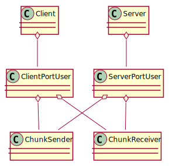
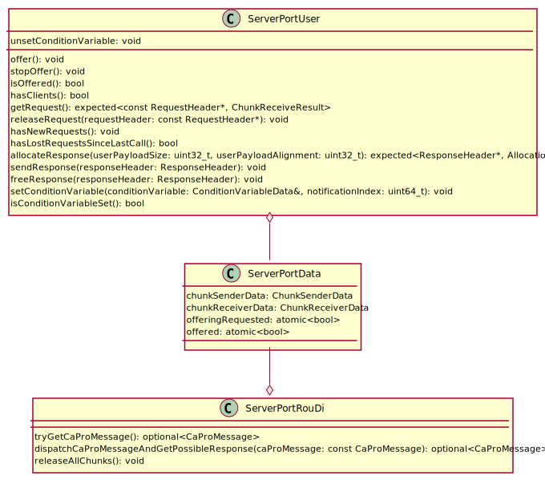

# Request/Response Communication

## Summary

Beside the publish-subscribe messaging pattern initially supported by iceoryx,
the request-response pattern is also widely used in the field where iceoryx is headed.
Since we aim for a good integration with ROS 2, this is also necessary to support its
`Service` communication method which is often used to control robots.

While publish-subscribe is a data distribution pattern which continuously delivers
updates on its data, request-response is a remote procedure call and task distribution pattern
which delivers data only on demand. This means there is one or several clients
requesting a server to perform a task.

In iceoryx, the client and server will be built on top of the same building blocks
we already use for publish-subscribe, like the `ChunkSender` and `ChunkReceiver`.

## Terminology

| Name              | Description                                              |
| :---------------- | :------------------------------------------------------- |
| Request-Response  | communication pattern which delivers data on demand      |
| Publish-Subscribe | communication pattern which continuously delivers updates on its data |
| RPC               | a remote procedure call to offload task to a server      |
| Client            | an entity invoking RPCs                                  |
| Server            | an entity processing RPCs                                |

## Design

### Considerations

Client and server shall be able to be used in combination with the `WaitSet` and `Listener`
to provide a means of event based communication instead of polling.

Like with publish-subscribe, the `ServiceDescription` will be used to connect clients with a corresponding server.

In order to support asynchronous requests, a sequence ID should be part of each request which will be copied to the corresponding response.

### Solution

This is an overview of the untyped `Client` and `Server` classes.

The `Client` and `Server` are reusing the `ChunkSender` and `ChunkReceiver` building blocks. The `Client` uses a `ChunkSender` to send requests and a `ChunkReceiver` to get the responses while the `Server` uses a `ChunkReceiver` to get the requests and a `ChunkReceiver` to send the responses.

#### Typed API

#### Untyped API

#### Client Port

The `ClientPortData` is located in the shared memory and contain only the data but no methods to access them.
`ClientPortUser` is the class providing the methods for the user access and `ClientPortRouDi` provides the
interface RouDi needs to connect the client to the server and to cleanup the port resources.

#### Server Port

Similar to the Client Port, the Server Port has `ServerPortData` which is located in the shared memory and contain only the data but no methods to access them.
`ServerPortUser` is the class providing the methods for the user access and `ServerPortRouDi` provides the
interface RouDi needs to connect the client to the server once the server offers its service and to cleanup the port resources.

- fire and forget -> notification

In the client options, we can have:
FireAndForget option
blocking, timed blocking, non blocking options
Field for configuring queue sizes and their overflow strategy
ConnectOnCreate option

In the server options, we can have:
kPoll, kEvent, kSingleThread option as discussed above
enum class for exception types in response header
Field for configuring queue sizes and their overflow strategy
SubscribeOnCreate option

### Code example

## Open issues

- integration into a gateway, e.g. the DDS gateway
